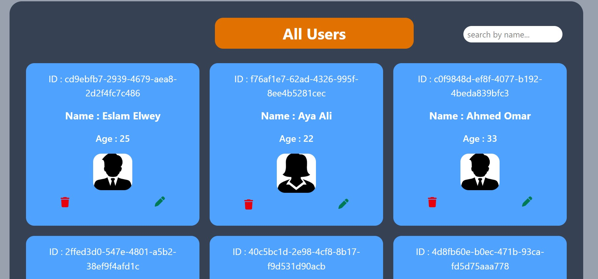

# React App Form
A responsive and user-friendly form application built with React.js, designed to demonstrate form handling, validation, and state management.

## <a href="https://www.linkedin.com/posts/eslam-elwey_reactjs-webdevelopment-iti-activity-7324799030603972608-2bD_?utm_source=share&utm_medium=member_desktop&rcm=ACoAACl3P40BgyjeC9WVPCK-1m9RnqS_BGrQFkY">Demo</a>

## 🚀 Features
Dynamic form fields with real-time validation

State management using React Hooks

Responsive design for various devices

Clean and modular code structure

Integration with external APIs for data submission (if applicable)

## 🛠️ Technologies Used
React.js

JavaScript (ES6+)

HTML5 & CSS3

tailwindCSS

